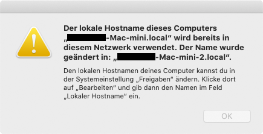
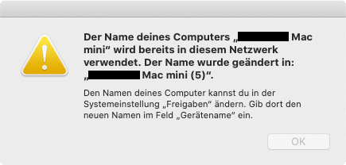

# mdns-repeater

mdns-repeater is an application level gateway which re-broadcasts Multicast DNS
(mDNS) packets received on one interface to other interfaces. Since mDNS is
"administratively scoped" such a gateway is required when mDNS resolutions
should work across subnet borders.

## Introduction

There are several application level gateways out there which re-broadcast mDNS
messages accross subnet borders. The most prominent example for Linux is
[Avahi](https://github.com/lathiat/avahi/) which can be run in so-called
reflector mode. If some time later after installing an Ahavi reflector in your
network error messages like the following occure then you should probably
continue reading.





Those error messages which have been captured on a Mac OS X system are caused
by a combination of two properties of the involved componentes:

- Avahi is caching mDNS responses and answers mDNS questions, even if they are
outdated.
- Devices regularly<sup id="a1">[1](#f1)</sup> perform Duplicate Name
Detection (DUND) in order to find out if someone else is using the same
hostname. If so, they decide to use another name.

Both properties in combination lead to the hassle that devices are constantly
renamed because Avahi responds to mDNS queries with answers sent previosly by
the device which currently performs a Duplicate Name Detection (DUND). Thus,
even though the hostname currently being checked is not used by anyone else in
the network, the system performing DUND believes that someone else is using
this name and hence selects a different hostname. To be more precise, even the
caching of mDNS responses in Avahi would not be so much of an issue if the
logic for answering mDNS questions would be more advanced. Actually there is no
need to reflect mDNS responses back to the subnets where they have been
received from because in those subnets the original responder can answer
questions without the help of an application level gateway. The problem is well
known to the Avahi community, see the following
[issue](https://github.com/lathiat/avahi/issues/117) for more details. However,
at time of writing this there was no patch provided so far.

[mdns-repeater](https://bitbucket.org/geekman/mdns-repeater/) as originaly
created by Darell Tan seemed promising to solve the above explained issue with
systems constantly being renamed because it neither caches any mDNS message,
nor does it refelect mDNS messages back to the same subnet where these messages
have been received from. This superior design compared to Avahi reflector made
it a good choice for further development. Kenny Levinsen an others improved the
original version of mdns-repeater with features like subnet white- and
blacklisting support and support for other platforms like FreeBSD. They have
published their work [here](https://github.com/kennylevinsen/mdns-repeater).

## What is New in this Fork

As it turned out during testing, the above mentioned versions of mdns-repeater
successfully solves the issue with renaming of devices but induces a new
problem which does not exist when using Avahi: In an IPv6-enabled network mDNS
responses can contain AAAA records which reference link local IP addresses.
These addresses are scoped to the local subnet - similar as mDNS packets.
Consequently, attempts to connect to hosts in other subnets using link local
addresses are failing. The improvement of the fork in this repository over
the previously existing versions is the added logic to filter out IPv6 link
local addresses from mDNS responses, in case they are present. That easier said
than done!

## Getting Started

The instructions below will guide you through the process of compiling and
installing mdns-repeater on a Debian system. With small deviations these
steps should also be applicable to other platforms.

### Prerequisites

First install the prerequisites needed to compile mdns-repeater:

```bash
# apt-get install build-essential
# apt-get install git
```

### Download Source Code

Download the source code of mdns-repeater:

```bash
# git clone https://github.com/devsecurity-io/mdns-repeater.git
```

### Compiling

To compile mdns-repeater first change to the directory where the source tree
was checked out then type the following command:

```bash
# make all
```

### Usage

mdns-repeater only requires the interface names and it will do the rest.
Example:

```bash
# mdns-repeater eth0 eth1
```

You can also specify the -f flag to keep mdns-repeater running in foreground.
To print out parsed mDNS packets as they are received you can further add the
-d flag.

### Installing

In order to start mdns-repeater on system startup execute the following steps:

1. Create configuration file

Replace the interfaces in the example with interfaces matching your
configuration.

```bash
# cat << EOF > /etc/default/mdns-repeater
# Options to pass to mdns-repeater
MDNS_REPEATER_OPTS="ens1 ens2"
EOF
```

2. Copy mdns-repeater executable

```bash
# cp mdns-repeater /usr/local/bin/
# chmod 755 /usr/local/bin/mdns-repeater
```

3. Install systemd unit file

```bash
# cp mdns-repeater.service /lib/systemd/system/
# chmod 644 /lib/systemd/system/mdns-repeater.service
```

4. Setup service

```bash
# systemctl enable mdns-repeater.service
# systemctl start mdns-repeater.service
```

## Handling of mDNS Messages

As stated in the sections before it is not sufficient to just forward mDNS
packets between network interfaces - at least not in IPv6-enabled netwoks.
Filtering out AAAA records containing IPv6 link local addresses from mDNS
responses is necessary to ensure communication between devices is possible
later on. This means that a received packet needs to be parsed and interpreted.
The implementation for parsing mDNS messages is based on (but not using)
Mattias Jansson's [mdns](https://github.com/mjansson/mdns) and
[foundation](https://github.com/mjansson/foundation_lib) libraries. The logic
implemented for handling mDNS messages in mdns-repeater is as follows: If there
is no AAAA record present in an mDNS packet received which contains an IPv6
link local address, the packet is just forwarded unchanged. If such a record is
present the received packet is recreated skipping all AAAA records with IPv6
link local addresses included. While it is rather easy to determine if an AAAA
record is present in a packet - even if the packet format is not fully
understood by the implementation, it is way more intricate to recreate proper
mDNS packets. The later is caused by the format of DNS
messages<sup id="a2">[2](#f2)</sup> which necessitates that an implementation
understands all message parts and record
types of a given message. Since DNS records can
reference<sup id="a3">[3](#f3)</sup> other parts in a message you cannot just
remove parts of a message while maintaining syntactical correctness of the
rest.

## mDNS Message Format

The message format for Multicast DNS and DNS only deviates in small details
why no distinction is made in this section.

Basically a DNS packet consist of three sections:

- Header
- Questions
- Answers

The answer section can consist of up to three different answer types. For
DNS queries it is also perfectly valid that the answer section is empty. The
following answer types exists:

- Answer
- Authority
- Additional

While the header and question sections are generic, that is they are not record
type specific, the entries in the answer sections are highly specific to the
given record type.

## Supported mDNS Messages

Whereas the header and the question sections are fully understood by the
present implementaion this does not hold true for the answer sections. As
pointed out in the previous section the format of entries in the answer
sections are specific to the record type. From that you can infer that it is
easy to determine if an mDNS packet contains an AAAA record because the
implementation only needs to be able to parse the format of an AAAA record
(besides the general structure of a DNS packet). Rebuilding a DNS packet is,
however, a lot more challenging since for that each record type which shall be
present in the resulting DNS packet needs to be understood by the
implementation.

The following record types are currently supported by this fork of
mdns-repeater:

| Record Type | Supported | Remark |
|:------------|:---------:|:-------|
| PTR | x |  |
| SRV | x |  |
| A | x |  |
| AAAA | x |  |
| TXT | x |  |
| OPT | partially |  Options in the variable part of this record type are not parsed but just copied over to the resulting packet without any further checks. |
| NSEC | partially |  The type bitmap in this record type is not parsed but just copied over to the resulting packet without any further checks. |

See below how you can contribute to extend the set of supported DNS record types.

## Known Limitations

- mdns-repeater handles mDNS packets only via IPv4. IPv6 is not yet supported.
That is, packets are received on the multicast address 224.0.0.251 but not on
ff02::fb. IPv6 addresses in AAAA records of mDNS payloads are irregardless
of the transport protocol supported.
- DNS message compression can be parsed by this implementation but built
DNS packets do not employ message compression.
- The memory management of the type string_t is a little bit lazy although for
that very reson highly efficient. No data is copied over if not necessary. On
the downside of that, accessing memory location no longer allocated is super
easy and hence using this type is error prone.
- NSEC records as specified in
[RFC4034](https://tools.ietf.org/html/rfc4034#section-4.1) and which are
mandatory by the Multicast DNS specification
([RFC6762](https://tools.ietf.org/html/rfc6762#section-6.1)) are parsed
only partially. The type bit maps field is just copied over to the resulting
packet without any kind of inspection. This, however, should not be really a
limitation for the operation of mdns-repeater.
- OPT pseudo records as specified in
[RFC6891](https://tools.ietf.org/html/rfc6891#section-6) are only parsed
partially. Options in the variable part of a record are just copied over to the
resulting packet without further analysis. This, however, should not be really
a limitation for the operation of mdns-repeater.

## Contributing

There are several ways in which you can contribute to this software:

- Create a pull request
- Provide PCAPs with mDNS packets that contain DNS records not yet supported
- Downloade, compile and test the software on other platforms (not yet
tested / supported)

Providing a PCAP especially makes sense if you face the following error
message -  either on terminal or in syslog:

``Warning: Record type 0xXXXX could not be parsed and thus could not be added to the resulting packet.``

Please make sure that PCAPs only contain relevant mDNS traffic. Further make
sure that no private information is disclosed by the PCAPs.

Happy to receive PCAPs on the following address:
mdnsrepeater@devsecurity.io

## Authors

- **Darell Tan**
- **Kenny Levinsen**
- **Mattias Jansson et al.**
- **Matthias Dettling**

See also the list of
[contributors](https://github.com/devsecurity-io/mdns-repeater/graphs/contributors)
who participated in this project.

## License

This project is licensed under the GNU General Public License, Version 2 - see
the [LICENSE](LICENSE) file for details.

## Acknowledgments

- **Darell Tan** who created the initial version of this
[program](https://bitbucket.org/geekman/mdns-repeater/) and who described it in
this [blog post](http://irq5.io/2011/01/02/mdns-repeater-mdns-across-subnets/).
- **Kenny Levinsen** and contributrors for maintaining the code and adding
features in this [repository](https://github.com/kennylevinsen/mdns-repeater).
- **Mattias Jansson** for the inspiration and source code of his
[mdns](https://github.com/mjansson/mdns) and
[foundation](https://github.com/mjansson/foundation_lib) libraries.

---
<b id="f1">1</b> Actually the exact trigger when Duplicate Name
Detection (DUND) is performed on Mac OS X is unclear. See also
[this page](https://apple.stackexchange.com/questions/125411/how-do-i-stop-my-computer-name-from-automatically-and-incorrectly-changing)
for more information. A DUND, however, can be forced by rebooting the whole
system. This insight is especially important when you want to test if the
present implementation successfully solves the issue with the renaming of
network devices. [↩](#a1)</br>
<b id="f2">2</b> Multicast DNS uses the same message format as DNS with very
little deviations. [↩](#a2)</br>
<b id="f3">3</b> See DNS message compression for an example:
[RFC1035](https://tools.ietf.org/html/rfc1035#section-4.1.4) [↩](#a3)